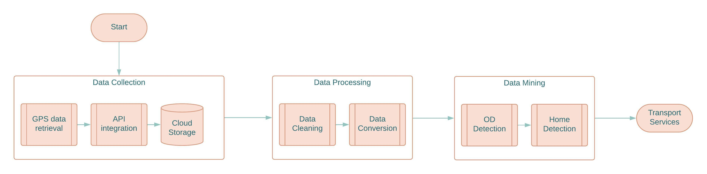
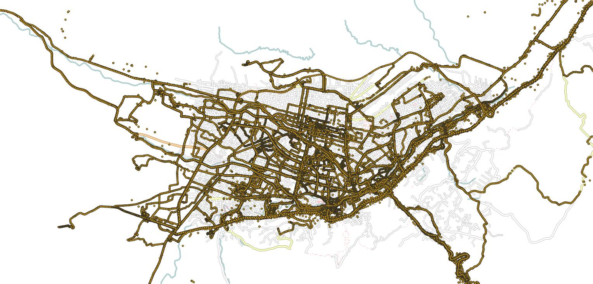
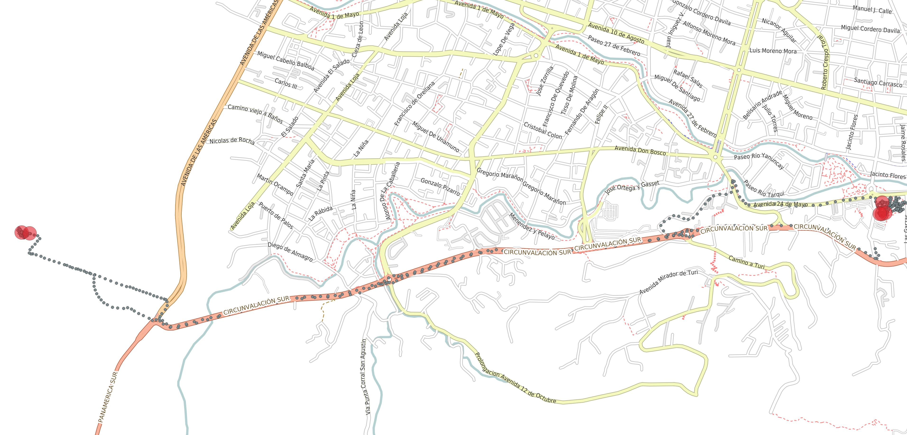
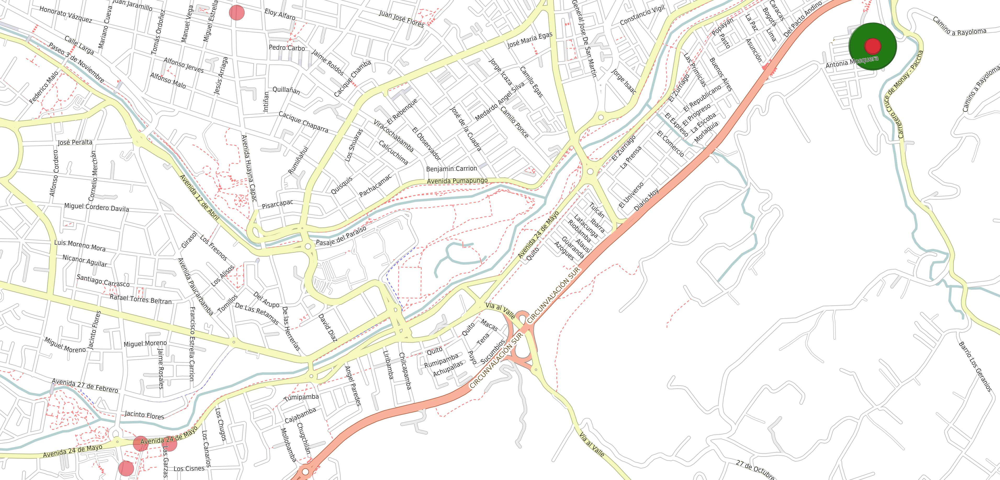
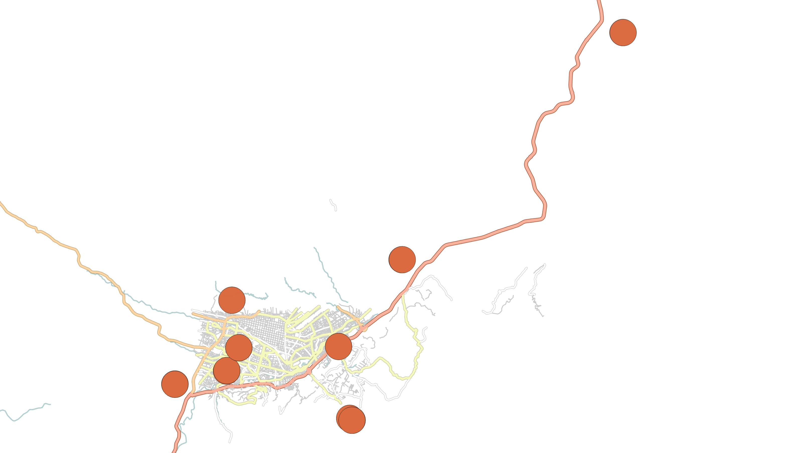

```{r setup, include=FALSE}
knitr::opts_chunk$set(fig.height=3.5,fig.align = "center",echo = FALSE, warning = F, message = F, comment = "",error = F)
library(dplyr)
library(tidyr)
library(lubridate)
library(tictoc)
library(dbscan)
library(rgdal)
library(OpenStreetMap)
library(ggplot2)
library(gridExtra)
library(sqldf)
library(descriptr)
library(digest)
source("libraries.R")

```


# Introduction

Gaining insights into the mobility patterns and points of interest among college students is crucial in developing effective strategies to optimize transportation for both students and the entire city. In the scope of this study, our objective is to identify and analyze the precise locations of student residences from a college community, utilizing mobile app data.  


Mobile phone data can be a useful source for official statistics, but there are challenges and uncertainties that need to be addressed before they can be used. Detecting home locations from mobile phone data and analyzes the performance of five home detection algorithms, offering recommendations for more reliable use of mobile phone data in official statistics.


Some studies like [@osorio2019social] demonstrates the potential of using social media data, specifically Twitter, for studying urban mobility patterns. However, the authors note the limitations of the data, such as biases in social media usage and the need for ongoing validation and improvement of the methods used.  In other study [@pappalardo2021evaluation] about Home Detection Algorithms (HDAs) using mobile phone data for official statistics. The authors found that the type of data stream used, and the algorithm choice significantly influenced the accuracy of home detection. Algorithms based on weekdays and/or nighttime records were the most accurate and using Extended Detail Records (XDRs) with specific algorithms yielded the best results. Daytime records and spatial perimeter-based algorithms had low accuracy and should be avoided. XDRs and Cellular Positioning Records (CPRs) were more resilient to data reduction compared to Call Detail Records (CDRs). The study had limitations in sample size and lack of demographic information. In [@ahas2010using] concludes that mobile positioning data can be used to monitor population geography and mobility, particularly in socially unstable or rapidly developing regions. However, further work is needed to standardize the data and model for different sources and conditions. The methodology is promising for geographical research and offers opportunities for real-time monitoring tools, geographical applications, tourism development, traffic management, urban planning, and optimizing network services. Detecting the location of households from mobile phone data is a key challenge for the use of this data source in official statistics. The authors argue that current address detection methods suffer from a lack of consensus on criteria and limited validation capabilities. The article presents an analysis of five address detection algorithms applied to a large French Call Detail Record (CDR) dataset, showing that the choice of criteria in Home Detection Algorithms (HDAs) influences address location detection in up to 40% of users, and that HDAs perform poorly when compared to a validation dataset. In [@gauvin2020gender] the authors used mobile phone data and metadata, including call detail records (CDRs) enriched with gender, socioeconomic segment, and number of phone lines registered under that number, then analyzed the data to reveal a gender gap in mobility and mapped this mobility gap over administrative divisions to observe the association with lower income and lack of public and private transportation options. The paper concludes that there is a gender gap in urban mobility, where women visit fewer unique locations than men and distribute their time less equally among such locations. This mobility gap is associated with lower income and lack of public and private transportation options. 

In [@vanhoof2018assessing] the paper investigates the performance and capabilities of five popular criteria for home detection based on a very large mobile phone dataset from France. The study shows that most Home Detection Algorithms (HDAs) suffer from "blind" deployment of criteria to define homes and from limited possibilities for validation. The paper introduces a data-driven framework to assess the spatial uncertainty related to the application of HDAs. The findings appropriate spatial uncertainty in HDA and, in extension, for detection of meaningful places. The study shows how spatial uncertainties on the individuals' level can be assessed in absence of ground truth annotation, how they relate to traditional, high-level validation practices and how they can be used to improve results for, e.g., nation-wide population estimation. Therefore, the paper concludes that the proposed framework can be used to improve the accuracy of home detection algorithms and population estimation. In [@bojic2015choosing] the authors discuss the importance of knowing user location in the digital world, not only in real-time but also predicting future locations. It is necessary to semantically label a place, particularly detecting the most probable home location for a given user. The paper aims to provide insights on the differences among the ways how different types of human digital trails represent actual mobility patterns and the differences between the approaches interpreting those trails for inferring said patterns. The paper starts with an example showing how human mobility patterns described by means of radius of gyration are different for Flickr social network and dataset of bank card transactions. The paper considers several methods for home location definition known from the literature and demonstrates that although for bank card transactions they provide highly consistent results, home location definition detection methods applied to Flickr dataset happen to be way more sensitive to the method selected, stressing the paramount importance of adjusting the method to the specific dataset being used.In universities, there is a need to enhance student mobility, and various strategies have been suggested to achieve this goal. To implement effective policies, it is crucial to have dynamic origin-destination matrices (OD) that represent different scenarios. The widespread use of mobile devices has made it possible to automatically extract daily travel data through tracking apps, eliminating the need for traditional trip surveys. Mendoza et. al [@mendoza2020automatic] presents a new methodology for extracting multi-day mobility demand in universities using logs obtained from dedicated apps regularly used by students. The proposed approach was evaluated using real-life logs from a representative group of students over a five-month period. The results showed that this approach is effective in obtaining average demand data, which can be utilized in planning mobility strategies, as long as continuous tracking of mobility data is feasible through mobile devices.


The primary objective of this study is to filter out student homes from the collected mobile app data and categorize them. By accurately identifying these locations, we can lay the foundation for a more comprehensive analysis of student mobility patterns and points of interest. This research is part of a larger investigation focused on understanding the unique needs and preferences of a college community. By identifying their homes, we gain crucial insights into their daily commute patterns, transportation modes, and the places they frequent. Such information enables the college authorities and municipal stakeholders, to make data-driven decisions and develop tailored mobility plans that cater to the specific needs of the student population.

In this paper, we present the methodology used to collect and preprocess the mobile app data, with a specific focus on identifying student homes. We discuss the techniques employed to filter and categorize these locations accurately. Additionally, we delve into the analysis of student mobility patterns and points of interest derived from the identified residences. The results and their implications for decision-making are presented and discussed in detail.
The findings from this study will provide valuable to the understanding their mobility patterns, decision-makers can develop targeted interventions, optimize transportation systems, and create a supportive environment for the student community. This research underscores the significance of leveraging mobile app data to gain a comprehensive understanding of student mobility patterns and points of interest, facilitating evidence-based decision-making and the development of effective mobility plans. For this approach, a density-based heuristic is proposed to detect home location from big data, which are collected in real-time by a dedicated mobile application developed for this purpose. This document is organized in the following way: a literature review of related works about origin-destination (OD) and home detection; then a detailed explanation of the  methodology.  At the end, conclusions, then a discussion of results and future works are proposed to provide insights about potential future applications and research.

# Methodology

The Resulting locations of the student homes have to be mined from mobility data after these are processed following a multi-step procedure. The required steps are summarized through the flow chart found in Fig \ref{fig1}, then a deeper explanation follows in the next sections. 

```{r, echo=FALSE, out.width="90%", fig.cap="\\label{fig1}Multi-step procedure methodology for Big Data Home Detection."}

```

In a few words, data are collected by a mobile app which uses the Global Positioning System (GPS) sensors of the mobile device, so that they can be stored in a remote server via an Application Programming Interface (API). Then, these unprocessed data are cleaned to filter out outliers and transformed to a suitable format for further calculations. At last, origins and destinations (OD) are detected by some segmentation algorithm and later classified as potential home locations. Some potential transport services after acquiring this information are planned out to complete the flow.

## Mobile Data Collection

The first step, assuming a mobile app exists so that it can collect GPS data, is storing mobility data together with temporal and identity information in a remote database. Each observation *i* (a labeled spatiotemporal data point) will have the following structure:

$$ p_i = (x_i, y_i, t_i) $$
that is, in its simplest form, it consists on the location's coordinates $(x,y)$ of the tracked user at a specific time *t*. A more complete version of the observation is:

$$ p_i  = (uid_i, lat_i, lon_i, alt_i, date_i, t_i, dow_i, acc_i, timestamp_i) $$

* *uid*, is a user's unique identifier, normally a MD5 hash string which guarantees data is collected anonymously, but it still makes possible to know the user in the database. 

* *lat. lon, alt*, the point's latitude, longitude and altitude coordinates.

* *date*, a day-month-year string

* *t*, a 24-hour local time format for a continuous variable after applying this formula:

\begin{equation} 
  t  =  hours + \frac{minutes}{60} + \frac{seconds}{3600} 
\end{equation}

* *dow*, the day of the week the observation was captured, where 1 is Sunday  

* *acc*, accuracy in meters of the measurement as reported by the sensor API, lower values produce more accurate measurements.

* *timestamp*, A Unix based time stamp, allowing to treat dates as continuous variables. 

The set $P_a$ of data point observations collected in real-time by a user's mobile device, is stored in this format in a remote server for further off-line procedures. However, this format is not yet suitable for most calculations, so that further processing is required as described in the next steps.

## Data Processing

In order to avoid bias in the calculation of travel destinations, outliers are removed considering position accuracy and temporal constraints. A subset $P_a$ consists of more refined "valid" observations, selected through the following criteria.

\begin{equation}
  P_b  =  \{p_i\in P_a | acc_i< \alpha \}
\end{equation}

where $\alpha$ is a parameter that denotes the maximum allowed accuracy error in meters. Moreover, users can travel to destinations found in other regions, countries and even continents. For the purpose of this research, home locations must be found inside a study region at a medium-sized city level, so a bounding box defined by $[lon_{min}, lon_{max}, lat_{min}, lat_{max}]$ constraints the valid observation previously found.

\begin{equation}
  P_c  =  \{p_i\in P_b | (lat_{min}<lat_i<lat_{max}) \wedge   (lon_{min}<lon_i<lon_{max}) \}
\end{equation}

Because this research is intended to provide insights about transport services for students in a College Community, a time period where users are expected to regularly visit the campus must be selected. Then, a cutoff date defined by $[date_{min}, date_{max}]$ is used to select the final subset $P$.   

\begin{equation}
  P  =  \{p_i\in P_c | (date_{min}<date_i<date_{max}) \}
\end{equation}

At last, since OD detection requires computation of distances, a Cartesian projection is a better approach. For the selected study region the UTM-17S is chosen, so that longitude, latitude and altitude measures are transformed to euclidean space coordinates $(x,y,z)$. Since dates and accuracies are not needed anymore, each observation $p_i$ in the resulting processed set $P$ becomes:

$$ p_i  = (uid_i, x_i, y_i, z_i, t_i, dow_i) $$

**Dataset Description.-** 

The full dataset used in this study consists of spatiotemporal data, collected by a dedicated tracking mobile app for a College Community. It involves data from *728* users during one moth period, namely from May 20 to June 20, 2023. The results of the further analysis have proven 30 days of mobility data per user to be sufficient to identify home locations. The number of observations after the data cleaning process is above *11 million*, so that good infrastructure of the cloud storage is required to handle this volume of big data. A sample from the spatiotemporal dataset is presented below in Table \ref{tab1} for the five attributes mentioned earlier:

```{r load-data}

data <- read.csv("newdatasample.csv")
data$user <- substr(sapply(data$company_token, digest, algo="md5"),1,10)
data$date <- lubridate::ymd_hms(data$recorded_at)
datapoints <- changecoordsystem(data,longlabel = "longitude", latlabel = "latitude", targetproj = "+proj=utm +zone=17 +south  ellps=WGS84" )
datapoints$dow <- wday(datapoints$date)
datapoints$timestamp <- as.numeric(datapoints$date)
datapoints$ymd <- format(ymd_hms(datapoints$date),'%Y-%m-%d')
datapoints$hour <- round(hour(datapoints$date) + 
  minute(datapoints$date)/60 + second(datapoints$date)/3600,5) #decimal hour
subset <- datapoints %>% select(user,x,y,altitude,hour,dow,timestamp)
colnames(subset) <- c("uid","x","y","z","t","dow","timestamp")
knitr::kable(head(subset,10),align = "c",caption = "\\label{tab1}Sample observations from the Spatiotemporal Dataset",digits = 10)
```
The bounding box for the region of Cuenca, Ecuador contains longitudes between -79,084789233 and -78,933588295, and latitudes between -2,938030323 and -2,865347073. A picture of the sample of collected points on a map at scale 1:50000 is given in Fig \ref{fig2}, where it is shown that complete travel trajectories can be retrieved from data. The sampling frequency of the GPS, that is the time difference between measures was not fixed but around 2 seconds on average.

```{r, echo=FALSE, out.width="90%", fig.cap="\\label{fig2}Sample of collected points for the region of Cuenca, Ecuador."}

```

**Computing new attributes.-** 

Some additional features must be added to the existing dataset so that travel behavior can be evaluated. Let $p_i$ be the $i^{th}$ observation in a spatiotemporal dataset $P$. Then, the cumulative distance $D_{a,n}$ for a trajectory starting at point $a$ and consisting of the next $n$ observations is defined as:

\begin{equation}
  D_{a,n}=\sum_{i=a+1}^{a+n}d_{i, i-1}
\end{equation}

where $d_{i,j}$ is the euclidean distance between two observations.

\begin{equation}
  d_{i,j}=((x_i-x_{j})^2+(y_i-y_{j})^2)^{1/2}
\end{equation}

that is, the sum of distances between proximate points; then, instant speed at observation $i^{th}$ is computed by:

\begin{equation}
  s_{i} = \frac{d_{i,i-1}}{t_{i}-t_{i-1}}
\end{equation}

The resulting extended dataset has the following structure shown in Table \ref{tab2}, after making the mentioned computations, and then filtering out consecutive measures taken at the same time stamp (possibly duplicates); also the very first observation has to be removed in order to avoid division by zero in the speed calculation. Distances have been transformed to *km* so that speed unit is *km/h*. 

```{r load-speeds}
subsetone <- subset %>% filter(uid=="614820f9e6")
subsetone <- addSpeeds(subsetone)
knitr::kable(head(subsetone,10) %>% select(-c(uid,timestamp)),align = "c",caption = "\\label{tab2}Extended dataset with distances and speeds.",digits = 10)
```
Finally, a last filtering procedure removes observations with extreme speeds, as values beyond *130km/h* are very improbable (by checking speed limits within the studied region). These data are often related to extreme distances between proximate points, which can occur due to GPS bad measures.  

## Data Mining

Data traces of each user must be segmented into individual travels (geometries) so than OD's can be found at the start and end points. In order to aggregate data into trajectories, an heuristic considering low-speed hot spots as destinations is now described. Taken a single day displacements for a single user, the speeds and distances between proximate points variations that take place when traveling, staying on destination, changing to a different travel mode may allow to detect a trip's endpoints. The speed and distance distributions are shown in Fig \ref{fig3}.

```{r subsetset}
row.names(subsetone)<-NULL
subsetoneday <- subsetone[5:529,] #one day 30may2023
#subsetoneday <- subsetone
#write.csv(subsetoneday,"pointspaper.csv")
```

```{r speed-distance, fig.cap="\\label{fig3} Speed and distance distribution histograms for a single day and user."}
g1 <- ggplot(subsetoneday, aes(x=speed)) + geom_histogram()  + xlab("Speed (km/h)")
g2 <- ggplot(subsetoneday, aes(x=distance*1000)) + geom_histogram() + xlab("Proximate distance (m)")
grid.arrange(g1,g2,ncol=2)
```

As seen in the previous figure, most of the speeds and distances are closer to zero, probably because users spend most of their time walking or staying in one destination before starting the next trip. The changes in speed during the day can be seen in Fig \ref{fig4}.

\newpage

```{r speed-hour-plot, fig.cap="\\label{fig4}Speed variations along a 24-h single day."}
#ggplot(subsetoneday, aes(x=timestamp, y=speed))+geom_line()+ylab("Speed (km/h)")+xlab("Timestamp (s)")
ggplot(subsetoneday, aes(x=t, y=speed))+geom_line()+ylab("Speed (km/h)")+xlab("Time of the day (hours)") + xlim(0,24)
```

This means that, data points can be segmented into individual travels by detecting those locations when moving at very low speeds (staying still), with respect to a given speed tolerance $\epsilon$. It can be assumed that actual destinations are found in intervals where users are not moving for a minimum amount of time $t_{min}$, that is in the "valleys" shown in last figure; in contrast to traffic lights that will also produce zero speeds but will last only a few seconds. The following plot allows appreciating points merged into trips (clusters) for $\epsilon$=2km/h and $t_{min}$= 10 minutes, see Fig \ref{fig5}. Increasing $t_{min}$ will merge nearby trips into larger ones.

```{r}
library(dbscan)
tmin <- 10*60 #t between measures
vmax <- 2 #after removing los speeds
subsetoneday$id <- 1:nrow(subsetoneday)
subsetoneday$tripid <- 0
subsetoneday %>% filter(speed>vmax) -> validspeeds
validspeeds  %>% select(timestamp) ->dataframe
clusters <- dbscan(dataframe,eps = tmin, minPts = 2)
validspeeds$tripid <- factor(clusters$cluster)
for (i in 1:nrow(validspeeds)){
  t <- validspeeds[i,]
  subsetoneday[subsetoneday$id==t$id,]$tripid <- t$tripid
}
subsetoneday$tripid <- factor(subsetoneday$tripid)
```

```{r speed-hour2-plot, fig.cap="\\label{fig5}Speed variations along a single day."}
subsetoneday %>% filter(tripid!=0) -> plot 
ggplot(plot,aes(x=t,y = speed,color = tripid))+geom_point()+ylab("Speed (km/h)")+xlab("Timestamp (s)")+scale_y_continuous(trans = "sqrt")
```

At last, the fist (FP) and last (LP) point in each cluster allows extracting coordinates of the origin and destination, as well as the departure and arrival times (from the time stamps of these points). The travel time is simply the difference between the arrival and departure times; also, the cumulative distance of all points in a cluster indicates the trip travel distance. <!--The statistics of the extreme points of each cluster are given in table 3.-->

```{r clusters}
query <- "select t.tripid,min(t.id) origin_id,max(t.id) destination_id,min(t) departure, max(t) arrival,sum(t.distance) travel_distance, max(t)-min(t) travel_time from subsetoneday as t where t.tripid!=0 group by t.tripid order by t.tripid"
    trippoints <- sqldf(query)
query <- "select t.*,origin.x origin_x, origin.y origin_y, dest.x dest_x, dest.y dest_y from trippoints as t left join subsetoneday as origin on origin.id=t.origin_id left join subsetoneday as dest on dest.id=t.destination_id order by t.tripid"
    trippoints <- sqldf(query)
trips <- trippoints %>% select(tripid,departure,arrival,origin_x,origin_y,dest_x,dest_y)
colnames(trips) <- c("Cluster ID","FP time","LP time","FP x","FP y","LP x","LP y")
#knitr::kable(head(trips,10),align = "c",caption = "Extreme points in clusters.",digits = 10)    
```


A glimpse of the aggregate data into individual travels (one per cluster) is presented in Table \ref{tab4}.


```{r}
subsetoneday$tripid <- NULL
tripsoneday <- segmentTrips4(subsetoneday,tmin = 10*60,vmax = 2,minPts = 2)
tripsglimpse <- tripsoneday %>% select(tripid,ox,oy,dx,dy,departure,arrival,tdistance,ttime)
knitr::kable(head(tripsglimpse,10),align = "c",caption = "\\label{tab4}Sample trips for one single user and day",digits = 10)
#write.csv(tripsoneday,"destinationspaper.csv")
```

The resulting segmentation allows OD's to be detected. Their coordinates are given in the table as attributes "dx" and "dy" for destinations locations, and "ox" and "oy" for the origins. Fig \ref{fig6} presents on a map at scale 1:25000 the resulting user's destinations (as red spots). It can be noticed that as locations are repeatedly visited, some points could be merged into a single destination as possibly they are short displacements around the same location; this can be done by density-based clustering techniques; however this is not necessary for the upcoming analysis. By applying the algorithm to the full dataset of tracked users, segmented trajectories exhibit the statistics shown in Fig \ref{fig7}. Then, according to this report, the majority of trips occur on weekdays. Moreover, they are "short trips" below 30 minutes and 10km.  

```{r, echo=FALSE, out.width="90%", fig.cap="\\label{fig6}Sample destinations for one single user and day."}

```
```{r trips-plot, fig.cap="\\label{fig7}Trip statistics for the full dataset."}
subset$tripid <- NULL
subset <- addSpeeds(subset)
trips <- segmentTrips4(subset,tmin = 10*60,vmax = 2,minPts = 2)
p1 <- ggplot(trips, aes(x=dow)) + geom_histogram()
p2 <- ggplot(trips, aes(x=ttime)) + geom_histogram()  + xlim(c(0,5))
p3 <- ggplot(trips, aes(x=tdistance)) + geom_histogram() + xlim(c(0,50)) + ylim(c(0,200))
grid.arrange(p1,p2,p3,ncol=3)
```

**Home Detection.-** 

After destinations have been detected, another heuristic can be used to identify a user's home. Another concepts must be first defined. Let $T_k$ be a trip displacement identified by $k$, the following characteristics are known:

$$T_k=(o_k, d_k, dt_k, at_k, st_k)$$

* *$o_i$*, the origin data point with its own coordinates and time stamp

* *$d_i$*, the destination data point with its own coordinates and time stamp

* *$dt_i$*, the departure time (time at origin data point)

* *$at_i$*, the arrival time (time at destination data point)

* *$st_i$*, stay time at destination of this trip

\begin{equation}
  st_i =  dt_{i+1} - at_i
\end{equation}

That is, the stay time is the time spent on destination before the next trip starts. A first exploratory data analysis must be carried out with 31 users who have voluntarily provided an approximation of the location of their residence. Some statistics of these trips are presented in Fig \ref{fig8} (top), where it can be noticed that arrival times of home trips occur mostly in the evening, in contrast to no-home trips that do not exhibit a clear pattern as seen in the same figure (bottom).

```{r}
subsetone$tripid <- NULL
subsetone <- addSpeeds(subsetone)
tripsone <- segmentTrips4(subsetone,tmin = 12*60,vmax = 1,minPts = 2)
tripsone <- populateStayTime2(tripsone)
tripsone <- labelHomes3(tripsone)
#write.csv(tripsone,"newtripssample.csv")
tripsone %>% filter(home=="Y") -> hometrips
tripsone %>% filter(home=="N") -> nohometrips
```


```{r homes-plot, fig.cap="\\label{fig8} top) Trip statistics for home trips and bottom) for the rest of no-home trips."}
p1 <- ggplot(hometrips, aes(x=departure)) + geom_histogram() + xlab("Departure time (24-h)")
p2 <- ggplot(hometrips, aes(x=arrival)) + geom_histogram() + xlab("Arrival time (24-h)")
p3 <- ggplot(hometrips, aes(x=stayindestination/3600)) + geom_histogram() + xlab("Stay time (hours)")

p4 <- ggplot(nohometrips, aes(x=departure)) + geom_histogram() + xlab("Departure time (24-h)")
p5 <- ggplot(nohometrips, aes(x=arrival)) + geom_histogram() + xlab("Arrival time (24-h)")
p6 <- ggplot(nohometrips, aes(x=stayindestination/3600)) + geom_histogram() + xlab("Stay time (hours)")
grid.arrange(p1,p2,p3,p4,p5,p6,ncol=3, nrow=2)
```

Taking locations of those destinations found on each last day trip (avoiding inter-day trips), the results for the same one-user of the sample used in previous analysis but now for multiple days is shown in \ref{fig9}.

```{r}
#write.csv(trips,"alldestinations.csv")
#write.csv(hometrips,"hometrips.csv")
```
```{r alldest-plot, echo=FALSE, out.width="90%", fig.cap="\\label{fig9}Locations of last day trip destinations for a single user."}

```

It must be noticed that more than one location could appear as possible last day trip destination; the most frequent will be labeled as the "home location". To find it not only visually, a density based clustering such as DBSCAN [@schubert2017dbscan] must be carried out on this destination points. The dissimilarity measure of the algorithm is the euclidean distance to agglomerate single trip destinations into destinations of interest. By using a clustering radius of 50 meters with a minimum cluster size of 5 points (which means at least 5 home trips are required to detect it ), 5 different possible candidates were found but only the most frequent (the biggest cluster) has been assumed to be home as can be seen in the same Fig \ref{fig9}, where this location has been highlighted as a green spot.


```{r allhomes-plot}
trips <- populateStayTime2(trips)
trips <- labelHomes3(trips)
trips %>% filter(home=="Y") -> hometrips
#write.csv(hometrips,"allhomespaper.csv")
```
```{r, echo=FALSE, out.width="90%", fig.cap="\\label{fig10}Assumed home locations for a sample of users within the studied region of Cuenca, Ecuador."}

```

## Discussion and Conclussions

This paper states an approach to detect home locations based on data mining techniques such as clustering, exploratory data analysis and data segmentation. Home locations have been validated by users who have voluntarily provided an approximation of the location of their residence. The heuristic considers the last known destination per day, so that the more data are collected the more plausible the chance for the algorithm to capture the correct location. This approach creates clusters of recurrent destinations, after mobility data is aggregated into trips by segmentation techniques. It has been shown that one month of data is sufficient for users to exhibit patterns, which are required to identify those regions of interest.

The segmentation of data points must be done per user, since OD detection expects instant speeds to decrease below a reference value per trip, so that stay time when "not moving" reaches a minimum time threshold. The calibration of these two parameters make trips longer or shorter, and it could increase the chances to find locations of interest where the user stays for long periods. As the dataset contains track points from users, constraining the trips arrival times to an interval (morning, evening) could detect the college campus as well as home locations. In the next section some example use cases are provided. 

**Transport Service Applications.-** 

When taking into consideration the home location of several users within  studied area, a list of insights for different applications to provide transport services arise. A sample of assumed home locations are shown in \ref{fig10} for our region of interest.

Some possible applications are:

* A dedicated transport service for students at the beginning (end) of the day consisting of few bus lines. A current trend is to provide college communities with a electric bus service, and this approach could led to the design of those bus lines by retrieving the demand spatial spots.

* If home locations and the college campus are removed from the trips set, then a subset of regions of interest for the students is retrieved, providing a list of activities the students perform at different times of the day when they are not studying. Private or public transport companies could benefit from this information to provide services according to the expected departure times.

* At last, carpooling and ride-sharing campaigns could use this information to plan groups of students that live nearby, for sharing cars and rides to the college campus or other known regions of interest.

# References {-}
