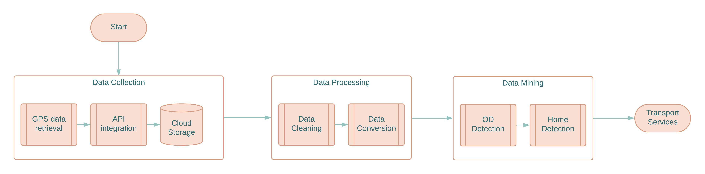

```{r setup, include=FALSE}
knitr::opts_chunk$set(fig.height=3.5,echo = FALSE, warning = F, message = F, comment = "",error = F)
library(dplyr)
library(tidyr)
library(lubridate)
library(dbscan)
library(digest)
library(rgdal)
library(ggplot2)
library(gridExtra)
library(skimr)
source("libraries.R")

```


# Introduction

Gaining insights into the mobility patterns and points of interest among college students is crucial in developing effective strategies to optimize transportation for both students and the entire city. 

In the scope of this study, our objective is to identify and analyze the **precise locations of student residences** from a college community, utilizing mobile app data.

# Methodology

The Resulting locations of the student homes have to be mined from mobility data after these are processed following a multi-step procedure. 

```{r, echo=FALSE, out.width="90%", fig.cap="\\label{fig1}Multi-step procedure methodology for Big Data Home Detection."}

```

Some potential transport services after acquiring this information are planned out to complete the flow.

# Mobile Data Collection

The first step, assuming a mobile app exists so that it can collect GPS data:

$$ p_i  = (uid_i, lat_i, lon_i, alt_i, date_i, t_i, dow_i, acc_i, timestamp_i) $$
It involves data from *728* users during one moth period, namely from May 20 to June 20, 2023. The results of the further analysis have proven 30 days of mobility data per user to be sufficient to identify home locations.

```{r}
data <- read.csv("20bestusers.csv")
data$user <- data$company_token#substr(sapply(data$company_token, digest, algo="md5"),1,10)
data$date <- lubridate::ymd_hms(data$recorded_at)
datapoints <- changecoordsystem(data,longlabel = "longitude", latlabel = "latitude", targetproj = "+proj=utm +zone=17 +south  ellps=WGS84" )
datapoints$dow <- wday(datapoints$date)
datapoints$timestamp <- as.numeric(datapoints$date)
datapoints$ymd <- format(ymd_hms(datapoints$date),'%Y-%m-%d')
datapoints$hour <- round(hour(datapoints$date) + 
  minute(datapoints$date)/60 + second(datapoints$date)/3600,5) #decimal hour
subset <- datapoints %>% select(user,x,y,altitude,hour,dow,timestamp)
colnames(subset) <- c("uid","x","y","z","t","dow","timestamp")
knitr::kable(head(subset,10),align = "c",caption = "\\label{tab1}Sample observations from the Spatiotemporal Dataset",digits = 10)
glimpse(datapoints)
```

# Data Processing

```{r, echo=FALSE, out.width="90%", fig.cap="\\label{fig2}Sample of collected points for the region of Cuenca, Ecuador."}
knitr::include_graphics("paper/images/mapa.jpeg")
```

---

```{r load-speeds}
subsetone <- subset %>% filter(uid=="614820f9e6")
subsetone <- addSpeeds(subsetone)
knitr::kable(head(subsetone,10) %>% select(-c(uid,timestamp)),align = "c",caption = "\\label{tab2}Extended dataset with distances and speeds.",digits = 10)
```


# Data Mining

```{r speed-distance, fig.cap="\\label{fig3} Speed and distance distribution histograms for a single day and user."}
subsetoneday <- subsetone[5:529,] #one day 30may2023
g1 <- ggplot(subsetoneday, aes(x=speed)) + geom_histogram()  + xlab("Speed (km/h)")
g2 <- ggplot(subsetoneday, aes(x=distance*1000)) + geom_histogram() + xlab("Proximate distance (m)")
grid.arrange(g1,g2,ncol=2)
```

Most of the speeds and distances are closer to zero, probably because users spend most of their time walking or staying in one destination before starting the next trip. 

---

```{r speed-hour-plot, fig.cap="\\label{fig4}Speed variations along a 24-h single day."}
#ggplot(subsetoneday, aes(x=timestamp, y=speed))+geom_line()+ylab("Speed (km/h)")+xlab("Timestamp (s)")
ggplot(subsetoneday, aes(x=t, y=speed))+geom_line()+ylab("Speed (km/h)")+xlab("Time of the day (hours)") + xlim(0,24)
```

---

The following plot allows appreciating points merged into trips (clusters) via DBSCAN for $\epsilon$=2km/h and $t_{min}$= 10 minutes, see Fig \ref{fig5}. Increasing $t_{min}$ will merge nearby trips into larger ones.

```{r}
library(dbscan)
tmin <- 10*60 #t between measures
vmax <- 2 #after removing los speeds
subsetoneday$id <- 1:nrow(subsetoneday)
subsetoneday$tripid <- 0
subsetoneday %>% filter(speed>vmax) -> validspeeds
validspeeds  %>% select(timestamp) ->dataframe
clusters <- dbscan(dataframe,eps = tmin, minPts = 2)
validspeeds$tripid <- factor(clusters$cluster)
for (i in 1:nrow(validspeeds)){
  t <- validspeeds[i,]
  subsetoneday[subsetoneday$id==t$id,]$tripid <- t$tripid
}
subsetoneday$tripid <- factor(subsetoneday$tripid)
```

```{r speed-hour2-plot, fig.cap="\\label{fig5}Speed variations along a single day."}
subsetoneday %>% filter(tripid!=0) -> plot 
ggplot(plot,aes(x=t,y = speed,color = tripid))+geom_point()+ylab("Speed (km/h)")+xlab("Timestamp (s)")+scale_y_continuous(trans = "sqrt")
```

---

At last, the fist (FP) and last (LP) point in each cluster allows extracting coordinates of the origin and destination, as well as the departure and arrival times.

```{r clusters}
query <- "select t.tripid,min(t.id) origin_id,max(t.id) destination_id,min(t) departure, max(t) arrival,sum(t.distance) travel_distance, max(t)-min(t) travel_time from subsetoneday as t where t.tripid!=0 group by t.tripid order by t.tripid"
    trippoints <- sqldf(query)
query <- "select t.*,origin.x origin_x, origin.y origin_y, dest.x dest_x, dest.y dest_y from trippoints as t left join subsetoneday as origin on origin.id=t.origin_id left join subsetoneday as dest on dest.id=t.destination_id order by t.tripid"
    trippoints <- sqldf(query)
trips <- trippoints %>% select(tripid,departure,arrival,origin_x,origin_y,dest_x,dest_y)
colnames(trips) <- c("Cluster ID","FP time","LP time","FP x","FP y","LP x","LP y")
#knitr::kable(head(trips,10),align = "c",caption = "Extreme points in clusters.",digits = 10)    
```


```{r}
subsetoneday$tripid <- NULL
tripsoneday <- segmentTrips4(subsetoneday,tmin = 10*60,vmax = 2,minPts = 2)
tripsglimpse <- tripsoneday %>% select(tripid,ox,oy,dx,dy,departure,arrival,tdistance,ttime)
knitr::kable(head(tripsglimpse,10),align = "c",caption = "\\label{tab4}Sample trips for one single user and day",digits = 10)
#write.csv(tripsoneday,"destinationspaper.csv")
```

---

The resulting segmentation allows OD's to be detected.

```{r, echo=FALSE, out.width="90%", fig.cap="\\label{fig6}Sample destinations for one single user and day."}
knitr::include_graphics("paper/images/destinos.jpeg")
```

---

Trip features are distributed as follows:

```{r trips-plot, fig.cap="\\label{fig7}Trip statistics for the full dataset."}
subset$tripid <- NULL
subset <- addSpeeds(subset)
trips <- segmentTrips4(subset,tmin = 10*60,vmax = 2,minPts = 2)
p1 <- ggplot(trips, aes(x=dow)) + geom_histogram()
p2 <- ggplot(trips, aes(x=ttime)) + geom_histogram()  + xlim(c(0,5))
p3 <- ggplot(trips, aes(x=tdistance)) + geom_histogram() + xlim(c(0,50)) + ylim(c(0,200))
grid.arrange(p1,p2,p3,ncol=3)
```

# Home Detection

After destinations have been detected, another heuristic can be used to identify a user's home, paying attention to these statistics.

```{r}
subsetone$tripid <- NULL
subsetone <- addSpeeds(subsetone)
tripsone <- segmentTrips4(subsetone,tmin = 12*60,vmax = 1,minPts = 2)
tripsone <- populateStayTime2(tripsone)
tripsone <- labelHomes3(tripsone)
#write.csv(tripsone,"newtripssample.csv")
tripsone %>% filter(home=="Y") -> hometrips
tripsone %>% filter(home=="N") -> nohometrips
```


```{r homes-plot, fig.cap="\\label{fig8} top) Trip statistics for home trips and bottom) for the rest of no-home trips."}
p1 <- ggplot(hometrips, aes(x=departure)) + geom_histogram() + xlab("Departure time (24-h)")
p2 <- ggplot(hometrips, aes(x=arrival)) + geom_histogram() + xlab("Arrival time (24-h)")
p3 <- ggplot(hometrips, aes(x=stayindestination/3600)) + geom_histogram() + xlab("Stay time (hours)")

p4 <- ggplot(nohometrips, aes(x=departure)) + geom_histogram() + xlab("Departure time (24-h)")
p5 <- ggplot(nohometrips, aes(x=arrival)) + geom_histogram() + xlab("Arrival time (24-h)")
p6 <- ggplot(nohometrips, aes(x=stayindestination/3600)) + geom_histogram() + xlab("Stay time (hours)")
grid.arrange(p1,p2,p3,p4,p5,p6,ncol=3, nrow=2)
```

---

Taking locations of those destinations found on each last day trip (avoiding inter-day trips), the most frequent destination will be labeled as the "home location"

```{r}
#write.csv(trips,"alldestinations.csv")
#write.csv(hometrips,"hometrips.csv")
```
```{r alldest-plot, echo=FALSE, out.width="90%", fig.cap="\\label{fig9}Locations of last day trip destinations for a single user."}
knitr::include_graphics("paper/images/homes.jpeg")
```

---

To find it not only visually, a density based clustering such as DBSCAN [@schubert2017dbscan] must be carried out on this destination points. 


```{r allhomes-plot}
trips <- populateStayTime2(trips)
trips <- labelHomes3(trips)
trips %>% filter(home=="Y") -> hometrips
#write.csv(hometrips,"allhomespaper.csv")
```
```{r, echo=FALSE, out.width="90%", fig.cap="\\label{fig10}Assumed home locations for a sample of users within the studied region of Cuenca, Ecuador."}
knitr::include_graphics("paper/images/allhomes.jpeg")
```

# Discussion and Conclussions

- Detect home locations based on data mining techniques such as clustering
- Home locations have been validated by volunteer users.
- The heuristic considers the last known destination per day
- Mobility data is aggregated into trips by segmentation techniques. 
- It has been shown that one month of data is sufficient for users to exhibit patterns

The segmentation of data points must be done per user.

# Transport Service Applications

Some possible applications are:

* A dedicated transport service for students at the beginning (end) of the day consisting of few bus lines. 

* If home locations and the college campus are removed from the trips set, then a subset of regions of interest for the students is retrieved.

* At last, carpooling and ride-sharing campaigns could use this information to plan groups of students that live nearby, for sharing cars.

# References {-}
